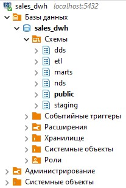
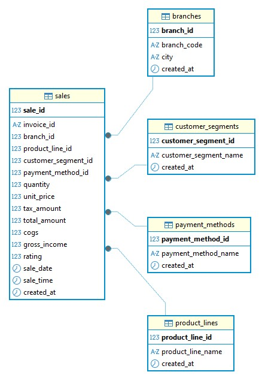
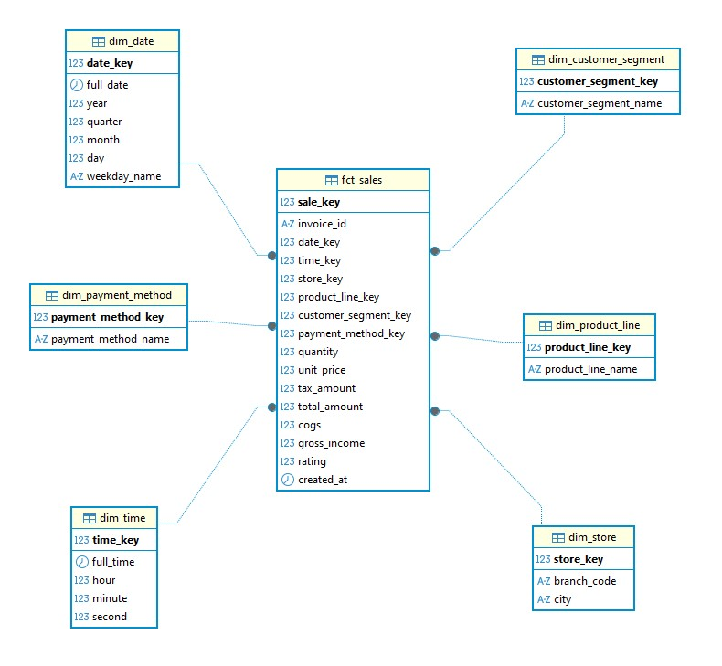

````md
# Sales Data Warehouse & ETL Pipeline

> First educational ETL/Data Warehouse project made during Data Engineering diploma study

---

# Project Overview

Этот проект я делал как дипломную работу по направлению Data Engineering.

Это мой первый полноценный проект, где я пытался самостоятельно построить ETL pipeline и небольшое аналитическое хранилище данных.

Главная цель проекта — понять базовую архитектуру Data Warehouse, попробовать работу с ETL и научиться строить простой data pipeline от CSV файла до BI dashboard.

В качестве источника данных использовался датасет `supermarket_sales`.

---

# Project Features

- PostgreSQL Data Warehouse
- ETL pipeline на Python
- staging / NDS / DDS / marts layers
- Apache Airflow orchestration
- Data Quality checks
- Tableau dashboard
- Docker infrastructure

---

# Architecture

## Data Flow

```text
CSV -> staging -> NDS -> DDS -> marts -> Tableau
````

## Layers

| Layer   | Description                     |
| ------- | ------------------------------- |
| staging | слой загрузки сырых данных      |
| nds     | нормализованное хранилище       |
| dds     | dimensional model (star schema) |
| marts   | аналитические представления     |
| etl     | логирование и metadata          |

---

# Technology Stack

Во время проекта я использовал:

* Python
* pandas
* PostgreSQL
* SQLAlchemy
* Apache Airflow
* Docker Compose
* Tableau Public

Некоторые технологии я изучал прямо по ходу разработки, потому что раньше не работал с полноценным ETL pipeline.

---

# Data Warehouse Structure

## Staging

```text
staging.sales_raw
```

## NDS

```text
nds.branches
nds.product_lines
nds.customer_segments
nds.payment_methods
nds.sales
```

## DDS

```text
dds.dim_date
dds.dim_time
dds.dim_store
dds.dim_product_line
dds.dim_customer_segment
dds.dim_payment_method
dds.fct_sales
```

## Marts

```text
marts.v_sales_analytics
```

---

# ETL Pipeline

## ETL Flow

```text
CSV -> staging -> NDS -> DDS -> marts
```

## ETL Scripts

```text
src/etl/load_to_staging.py
src/etl/load_nds.py
src/etl/load_dds.py
src/etl/load_marts.py
```

## ETL Execution Order

```text
load_to_staging
-> dq_staging
-> load_nds
-> dq_nds
-> load_dds
-> dq_dds
-> load_marts
```

---

# Data Quality Checks

В проекте были добавлены простые проверки качества данных:

* NULL checks
* duplicate invoice_id checks
* foreign key checks
* numeric validation
* quantity validation
* revenue validation

Некорректные записи сохраняются в:

```text
etl.dq_rejected_records
```

Так как это учебный проект, проверки сделаны в базовом варианте.

---

# Metadata & Logging

Для логирования ETL процессов были созданы таблицы:

```text
etl.etl_runs
etl.etl_run_steps
etl.dq_rejected_records
```

В них хранится:

* история запусков
* статусы pipeline
* количество обработанных строк
* ошибки Data Quality

---

# Airflow Orchestration

Airflow DAG:

```text
airflow/dags/sales_dwh_etl_dag.py
```

Tasks:

* load_to_staging
* run_staging_dq
* load_nds
* run_nds_dq
* load_dds
* run_dds_dq
* load_marts

Airflow использовался для:

* orchestration ETL pipeline
* task dependencies
* monitoring
* scheduling

Это был мой первый опыт работы с Apache Airflow, поэтому DAG сделан достаточно простым.

## Airflow DAG


---

# Tableau Dashboard

В Tableau был создан dashboard с основной аналитикой продаж.

Dashboard включает:

* Revenue Trend by Date
* Revenue by Product Line
* Revenue by Branch

Также были добавлены KPI:

* Total Revenue
* Total Sales
* Average Customer Rating

Workbook:

```text
tableau/workbook/Sales_Analytics_Dashboard.twbx
```

## Dashboard Screenshot


---

# Diagrams

## DWH Architecture



## NDS ERD



## DDS Star Schema



---

# Architecture Decisions

Во время проекта были выбраны следующие решения:

* использована star schema для аналитики
* ETL реализован как full refresh
* marts layer сделан через SQL views
* incremental loading пока не реализован
* SCD Type 2 не реализован

Некоторые вещи специально не усложнялись, потому что проект учебный и делался впервые.

---

# Project Structure

```text
sales-dwh-diploma/
├── airflow/
├── data/
├── diagrams/
├── docker/
├── sql/
├── src/
├── tableau/
├── docker-compose.yml
├── requirements.txt
└── README.md
```

---

# Running the Project

## 1. Clone repository

```bash
git clone <repository_url>
cd sales-dwh-diploma
```

## 2. Start infrastructure

```bash
docker compose build
docker compose up -d
```

## 3. Open Airflow

```text
http://localhost:8080
```

Login:

```text
admin / admin
```

## 4. Run ETL Pipeline

Запуск DAG:

```text
sales_dwh_etl_dag
```

---

# Validation Queries

```sql
SELECT COUNT(*) FROM staging.sales_raw;

SELECT COUNT(*) FROM nds.sales;

SELECT COUNT(*) FROM dds.fct_sales;

SELECT SUM(sales_count)
FROM marts.v_sales_analytics;
```

---

# Future Improvements

Что можно улучшить в будущем:

* incremental loading
* SCD Type 2
* CI/CD
* cloud deployment
* more Data Quality checks

---

# Result

Во время выполнения проекта я получил первый практический опыт:

* построения ETL pipeline
* работы с PostgreSQL
* проектирования Data Warehouse
* работы с Apache Airflow
* создания BI dashboard
* реализации Data Quality checks

Проект помог мне лучше понять основы Data Engineering и архитектуру аналитических систем.

```
```