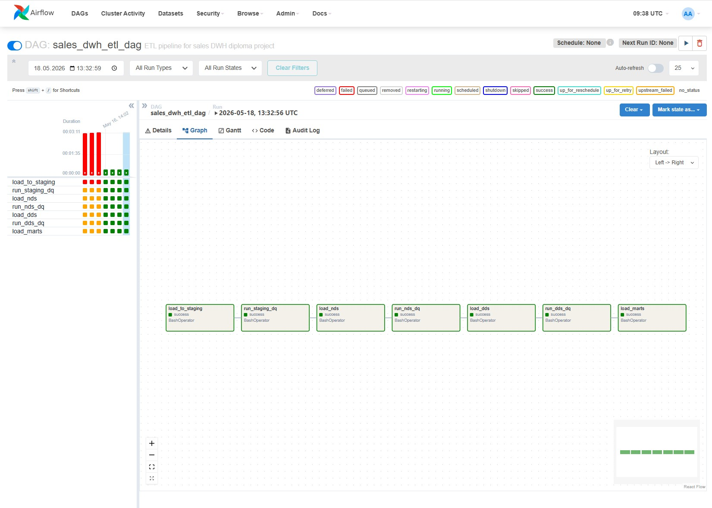
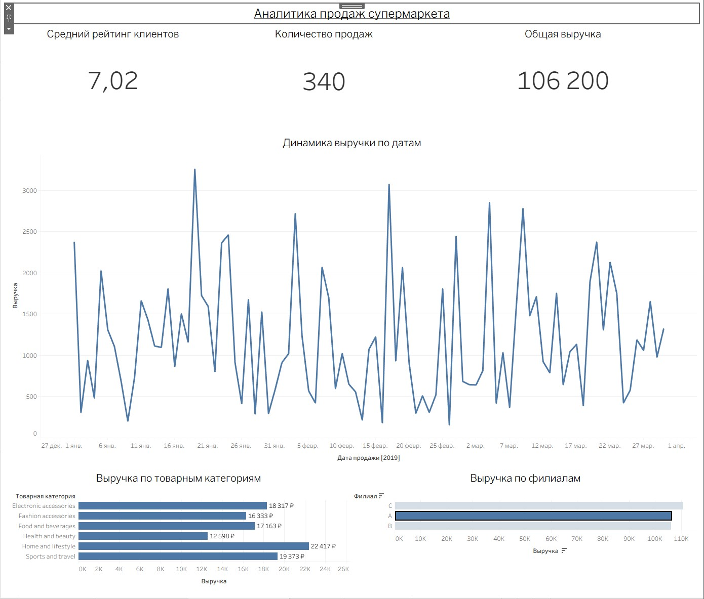

# Sales Data Warehouse & ETL Pipeline

## Project Overview

This project was created as a diploma project for the Data Engineer profession.

The goal of the project is to build a simple end-to-end ETL pipeline and analytical Data Warehouse based on the `supermarket_sales` dataset.

The project includes:

- PostgreSQL Data Warehouse
- staging / NDS / DDS / marts layers
- Python ETL scripts
- Apache Airflow orchestration
- Data Quality checks
- ETL metadata and logging
- Tableau dashboard
- Dockerized infrastructure

---

# Architecture

## Data Flow

CSV -> staging -> NDS -> DDS -> marts -> Tableau

## Layers

- staging — raw data ingestion layer
- nds — normalized data store
- dds — dimensional star schema
- marts — analytical BI views
- etl — metadata and logging layer

---

# Technology Stack

- Python
- pandas
- PostgreSQL
- SQLAlchemy
- Apache Airflow
- Docker Compose
- Tableau Public

---

# Data Warehouse Structure

## Staging

- staging.sales_raw

## NDS

- nds.branches
- nds.product_lines
- nds.customer_segments
- nds.payment_methods
- nds.sales

## DDS

- dds.dim_date
- dds.dim_time
- dds.dim_store
- dds.dim_product_line
- dds.dim_customer_segment
- dds.dim_payment_method
- dds.fct_sales

## Marts

- marts.v_sales_analytics

---

# ETL Pipeline

## ETL Flow

CSV -> staging -> NDS -> DDS -> marts

## ETL Scripts

```text
src/etl/load_to_staging.py
src/etl/load_nds.py
src/etl/load_dds.py
src/etl/load_marts.py
```

## ETL Execution Order

```text
load_to_staging
-> dq_staging
-> load_nds
-> dq_nds
-> load_dds
-> dq_dds
-> load_marts
```

---

# Data Quality Checks

Implemented validations:

- NULL checks
- duplicate invoice_id checks
- foreign key checks
- numeric validation
- invalid quantity validation
- invalid revenue validation
- marts validation

Rejected records are stored in:

```text
etl.dq_rejected_records
```

---

# Metadata & Logging

The project includes ETL metadata tables:

- etl.etl_runs
- etl.etl_run_steps
- etl.dq_rejected_records

These tables store:

- ETL execution history
- pipeline statuses
- processed row counts
- Data Quality rejected rows
- error messages

---

# Airflow Orchestration

Airflow DAG:

```text
airflow/dags/sales_dwh_etl_dag.py
```

Pipeline tasks:

- load_to_staging
- run_staging_dq
- load_nds
- run_nds_dq
- load_dds
- run_dds_dq
- load_marts

Airflow is used for:

- ETL orchestration
- dependency management
- pipeline scheduling
- monitoring ETL execution

---

# Tableau Dashboard

The Tableau dashboard contains:

- Revenue Trend by Date
- Revenue by Product Line
- Revenue by Branch

KPI cards:

- Total Revenue
- Total Sales
- Average Customer Rating

Workbook:

```text
tableau/workbook/Sales_Analytics_Dashboard.twbx
```

---

# Screenshots

## Airflow DAG



## Tableau Dashboard



---

# Architecture Decisions

- Star schema was selected for analytical reporting.
- Full refresh ETL strategy was used for simplicity.
- marts layer implemented as SQL views.
- SCD Type 2 was not implemented.
- Incremental loading was not implemented.
- Airflow was used as orchestration layer.
- Data Quality checks were added between ETL stages.

---

# Project Structure

```text
sales-dwh-diploma/
├── airflow/
├── data/
├── diagrams/
├── docker/
├── sql/
├── src/
├── tableau/
├── docker-compose.yml
├── requirements.txt
└── README.md
```

---

# Running the Project

## 1. Clone repository

```bash
git clone <repository_url>
cd sales-dwh-diploma
```

## 2. Start infrastructure

```bash
docker compose build
docker compose up -d
```

## 3. Open Airflow

```text
http://localhost:8080
```

Login:

```text
admin / admin
```

## 4. Run ETL Pipeline

The ETL pipeline can be executed from Airflow UI using:

```text
sales_dwh_etl_dag
```

---

# Validation Queries

```sql
SELECT COUNT(*) FROM staging.sales_raw;

SELECT COUNT(*) FROM nds.sales;

SELECT COUNT(*) FROM dds.fct_sales;

SELECT SUM(sales_count)
FROM marts.v_sales_analytics;
```

---

# Future Improvements

Possible future improvements:

- incremental loading
- SCD Type 2
- CI/CD
- cloud deployment

---

# Result

The project demonstrates:

- end-to-end ETL implementation
- Data Warehouse architecture design
- dimensional modeling
- Airflow orchestration
- Data Quality implementation
- BI dashboard development

---

# Author

Data Engineering Diploma Project
